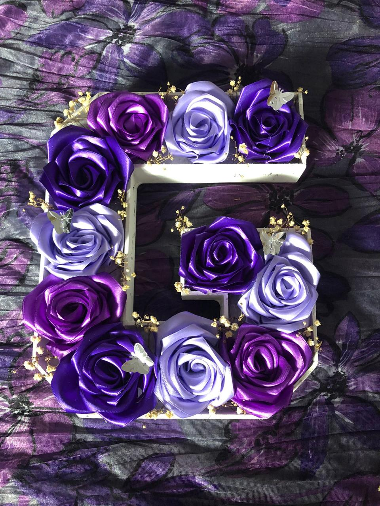

<!DOCTYPE html>
<html lang="es">
<head>
  <meta charset="UTF-8">
  <title>Dilo con amor</title>
  <link rel="icon" href="favicon-16x16.jpeg" type="image/jpeg">
  <link rel="stylesheet" href="https://cdnjs.cloudflare.com/ajax/libs/font-awesome/6.5.0/css/all.min.css">
  
</head>
<body>
  <header>
    <h1>Dilo con amor</h1>
    
  </header>

  <nav>
    <a onclick="mostrarSeccion('quienes')">Inicio</a>
    <a onclick="mostrarSeccion('catalogo')">Catálogo</a>
    <a onclick="mostrarSeccion('comunicate')">Comunícate</a>
    <a onclick="mostrarSeccion('ubicacion')">Ubicación</a>
  </nav>

  <section id="quienes" class="active">
    <h2>¿Quiénes somos?</h2>
    
Somos una empresa que desea brindar experiencias que se recuerdan por siempre y qué mejor que un regalo eterno como flores, arreglos que se pueden conservar. Nacimos con la idea de que cada regalo debe contar una historia y por eso cuidamos cada detalle con dedicación y creatividad.

    <h2>Visión</h2>
    
Ser reconocida como una empresa eficiente con los trabajos realizados, destacando el compromiso y dedicación que se tiene con el cliente, buscando el mejor resultado y satisfacción.

    <h3>Objetivos</h3>
    <ul>
      <li>Crear arreglos personalizados que reflejen emociones.</li>
      <li>Ampliar nuestra presencia en redes.</li>
      <li>Fomentar el uso de flores preservadas.</li>
      <li>Ofrecer productos únicos para eventos.</li>
    </ul>
  </section>

  <section id="catalogo">
    <h2>Catálogo de Productos y Servicios</h2>
    

      

        <h3>💐 Arreglos Florales</h3>
        <ul>
          <li>Flores eternas individuales</li>
          <li>Arreglos en cajas decorativas</li>
          <li>Jarrones con luz LED</li>
          <li>Arreglos florales personalizados</li>
          <li>Letras decorativas con flores</li>
        </ul>
        <h3>🍼 Baby Shower</h3>
        <ul>
          <li>Cintó para la mami</li>
          <li>Corsage para el papá</li>
          <li>Distintivos para los invitados</li>
          <li>Canastas decoradas</li>
        </ul>
        <h3>📦 Otros</h3>
        <ul>
          <li>Pulseras</li>
          <li>Plumas decoradas</li>
          <li>Portarretratos</li>
          <li>Ramos con dulces</li>
          <li>Frascos con flores y bombones, galletas, dulces, chocolates, etc.</li>
        </ul>
      

      

        <h3>💍 Bodas</h3>
        <ul>
          <li>Ramos de novia personalizados</li>
          <li>Mini ramos para lanzar</li>
          <li>Mini ramos para damas de honor</li>
          <li>Cojines para anillos</li>
          <li>Lazo matrimonial decorado</li>
          <li>Arras con estuche decorado</li>
          <li>Copas de brindis personalizadas</li>
          <li>Caja de pacto con diseño especial</li>
        </ul>
        <h3>👑 XV Años</h3>
        <ul>
          <li>Ramos de quinceañera</li>
          <li>Cojines decorativos</li>
          <li>Caja para pacto simbólico</li>
          <li>Copas de brindis</li>
        </ul>
      

      

        

          
        

      

    

  </section>

  <section id="comunicate">
    <h2 style="text-align:center;">Comunícate</h2>
    
Síguenos o contáctanos por redes sociales:

    

      
<a href="https://www.facebook.com/profile.php?id=61568670475896" target="_blank"><i class="fab fa-facebook"></i></a>Facebook

      
<a href="https://www.instagram.com/diloconamooor" target="_blank"><i class="fab fa-instagram"></i></a>Instagram

      
<a href="https://wa.me/5212291593502" target="_blank"><i class="fab fa-whatsapp"></i></a>WhatsApp

    

    
Horario: lunes a domingo de 10:00 am a 17:00 pm.

    
¿Tienes alguna duda? Escríbenos y te responderemos cuanto antes.

  </section>

  <section id="ubicacion">
    <h2>Ubicación</h2>
    
Para poder verlos y atenderlos en físico en esta dirección solo será con cita agendada

    
Estamos localizados en:

    <iframe src="https://www.google.com/maps/embed?pb=!1m18..." allowfullscreen="" loading="lazy"></iframe>
    
¿Qué esperas para venir y obsequiar el mejor detalle?

  </section>

  
</body>
</html>
